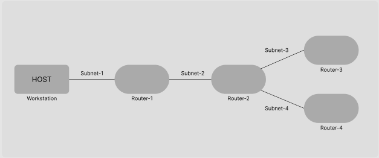

## Experiment 1
### Aim:
Introduction to discrete event simulation tools NS2, NS3 & installation of NS3.

### Introduction:
Network simulator is a tool used for simulating the real world network on one computer by writing scripts in C++ or Python. Normally if we want to perform experiments, to see how our network works using various parameters. We don’t have required number of computers and routers for making different topologies. Even if we have these resources it is very expensive to build such a network for experiment purposes.

So to overcome these drawbacks we used NS3, which is a discrete event network simulator for Internet.

### NS2:
NS2 stands for Network Simulator Version 2. It is an open-source event-driven simulator designed specifically for research in computer communication networks.

Network Simulator 2 (NS2) provides substantial support for simulation of different protocols over wired and wireless networks. It provides a highly modular platform for wired and wireless simulations supporting different network elements, protocols, traffic, and routing types.

### NS3: 

ns-3 is a discrete-event network simulator, targeted primarily for research and educational use. ns-3 is free software, licensed under the GNU GPLv2 license, and is publicly available for research, development, and use.

The ns-3 project is committed to building a solid simulation core that is well documented, easy to use and debug, and that caters to the needs of the entire simulation workflow, from simulation configuration to trace collection and analysis.

Furthermore, the ns-3 software infrastructure encourages the development of simulation models that are sufficiently realistic to allow ns-3 to be used as a realtime network emulator, interconnected with the real world, and that allows many existing real-world protocol implementations to be reused within ns-3.

### Difference between NS3 & NS2: 
| NS3 | NS2 |
| ----------- | ----------- |
| NS3 can be act as the emulator that it can connect to the real world | NS2 can not be act as the emulator. |
| Some of the NS2 models can be imported to NS3 | NS3 scripts can not run in NS2 environment |
| NS3 is written using C++ | NS2 is written with the help of TCL and C++. |
| Compilation time is not a matter | C++ recompilation takes more time more than TCL so most of the scripts are written using TCL |
| Information needed to send through the packet can be added at the header ,trailer, buffer ,etc | The header part of the NS2 includes all the information of header parts in the specified protocol |
| NS3 frees the memory that used to store the packets, The packet of ns3 consist of single buffer and small tags. | NS2 never reuse or re allocate the memory until it get terminated, The packet of ns2 has headers and data for payload. |
| Network Animator visualization is available | Nam animator is available for visualization.|

### Installation of NS3:

Download the [NS3](https://www.nsnam.org/releases/ns-3-30/download/) tar file.

Go to download folder
```bash
cd Download/
```

To check that the tar file is downloaded properly run 
```bash
ls
```
You'll see a `ns-allinone-3.<version>.tar.bz2`.


To extract the tar file run: 
```bash
tar -xvf ./ns-allinone-3.30.1.tar.bz2
```

To enter the ns-3 folder run
```bash
cd ns-allinone-3.30.1
```

Once you're in the `ns-allinone-3.30.1` directory, run:
```bash
./build.py --enable-examples --enable-tests
```

To install all dependency (in ubuntu) run:
```bash
apt install gcc python python-dev qty-dev-tools libgtk-3-dev python-pygoocanvas python-pygraphvizwiresharkgnuplot openjdk-7-jdk
```
If you're on ubuntu 18.04+ run:
```bash
apt install gir1.2-goocanvas-2.0 python3-gi python3-gi-cairo python3-pygraphviz gir1.2-gtk-3.0 ipython3
```
To enter the ns-3 folder
```bash
cd ./ns-3
```

To run tests
```bash
./test.py -c core
```

Now, to create a connection between 2 machines, copy the file named `first.cc` in `./tutorial/example/` to `./scratch` run:
```bash
./waf --run scratch/first
```

Now, to run the animator
```bash
cd ../
ls
cd ./netanim-3.108
./NetAnim
```

After running the commands above, you'll see a application has started, select the xml file that is created after compiling step, after selecting it you'll be able to see the packets transferring.


## Experiment 2

### Steps to run the code.

1. Code should be in the directory: `ns-allinone-3.27/ns-3.27/scratch`

2. Move to `ns-3.27` directory using the command: 
```bash
cd ../
```

3. Run the command: 
```bash
./waf --run/scratch/<program-name>
```

4. Output will be displayed on the terminal.

5. To view the animation run: 
```bash
cd ns-allinone-3.27/netanim-3.108
```

6. Run the command to launch the NetAnim application:
```bash
./NetAnim
```

8. Select the `XML` file, that is created after compilation.
9. Click the play button to run the animation.

## Experiment 2(a)

### Aim:
Create a 2 nodes point to point connection using ns3

### source Code:
```cpp
#include "ns3/core-module.h"
#include "ns3/network-module.h"
#include "ns3/internet-module.h"
#include "ns3/point-to-point-module.h"
#include "ns3/applications-module.h"
#include "ns3/netanim-module.h"

using namespace ns3;

NS_LOG_COMPONENT_DEFINE ("FirstScriptExample");

int main (int argc, char *argv[])
{
    CommandLine cmd;
    cmd.Parse (argc, argv);

    Time::SetResolution (Time::NS);
    LogComponentEnable ("UdpEchoClientApplication", LOG_LEVEL_INFO);
    LogComponentEnable ("UdpEchoServerApplication", LOG_LEVEL_INFO);

    NodeContainer nodes;
    nodes.Create (2);

    PointToPointHelper pointToPoint;
    pointToPoint.SetDeviceAttribute ("DataRate", StringValue ("5Mbps"));
    pointToPoint.SetChannelAttribute ("Delay", StringValue ("2ms"));

    NetDeviceContainer devices;
    devices = pointToPoint.Install (nodes.Get(0), nodes.Get(1));

    InternetStackHelper stack;
    stack.Install (nodes);

    Ipv4AddressHelper address;
    address.SetBase ("10.1.1.0", "255.255.255.0");

    Ipv4InterfaceContainer interfaces = address.Assign (devices);
    
    Ipv4GlobalRoutingHelper::PopulateRoutingTables();

    UdpEchoServerHelper echoServer (9);

    ApplicationContainer serverApps = echoServer.Install (nodes.Get (1));
    serverApps.Start (Seconds (1.0));
    serverApps.Stop (Seconds (10.0));

    UdpEchoClientHelper echoClient (interfaces.GetAddress (1), 9);
    echoClient.SetAttribute ("MaxPackets", UintegerValue (1));
    echoClient.SetAttribute ("Interval", TimeValue (Seconds (1.0)));
    echoClient.SetAttribute ("PacketSize", UintegerValue (1024));

    ApplicationContainer clientApps = echoClient.Install (nodes.Get (0));
    clientApps.Start (Seconds (2.0));
    clientApps.Stop (Seconds (10.0));

    AnimationInterface anim("m1.xml");
    anim.SetConstantPosition(nodes.Get(0), 1.0, 2.0);
    anim.SetConstantPosition(nodes.Get(1), 5.0, 5.0);

    Simulator::Run ();
    Simulator::Destroy ();
    return 0;
}
```

## Experiment 2(b)

### Aim:
To simulate a network containing 3 nodes with point-to-point connection using NS3.

### Source Code:
```cpp
#include "ns3/core-module.h"
#include "ns3/network-module.h"
#include "ns3/internet-module.h"
#include "ns3/point-to-point-module.h"
#include "ns3/applications-module.h"
#include "ns3/netanim-module.h"

using namespace ns3;

NS_LOG_COMPONENT_DEFINE ("FirstScriptExample");

int main (int argc, char *argv[])
{
    CommandLine cmd;
    cmd.Parse (argc, argv);

    Time::SetResolution (Time::NS);
    LogComponentEnable ("UdpEchoClientApplication", LOG_LEVEL_INFO);
    LogComponentEnable ("UdpEchoServerApplication", LOG_LEVEL_INFO);

    NodeContainer nodes;
    nodes.Create (3);

    PointToPointHelper pointToPoint;
    pointToPoint.SetDeviceAttribute ("DataRate", StringValue ("5Mbps"));
    pointToPoint.SetChannelAttribute ("Delay", StringValue ("2ms"));

    NetDeviceContainer devices;
    devices = pointToPoint.Install (nodes.Get(0), nodes.Get(1));

    InternetStackHelper stack;
    stack.Install (nodes);

    Ipv4AddressHelper address;
    address.SetBase ("10.1.1.0", "255.255.255.0");

    Ipv4InterfaceContainer interfaces = address.Assign (devices);

    PointToPointHelper pointToPoint1;
    pointToPoint1.SetDeviceAttribute ("DataRate", StringValue ("5Mbps"));
    pointToPoint1.SetChannelAttribute ("Delay", StringValue ("2ms"));

    devices = pointToPoint1.Install (nodes.Get(1), nodes.Get(2));
    address.SetBase ("10.1.2.0", "255.255.255.0");
    interfaces = address.Assign(devices);
    
    Ipv4GlobalRoutingHelper::PopulateRoutingTables();

    UdpEchoServerHelper echoServer (9);

    ApplicationContainer serverApps = echoServer.Install (nodes.Get(1));
    serverApps.Start (Seconds (1.0));
    serverApps.Stop (Seconds (10.0));

    UdpEchoClientHelper echoClient (interfaces.GetAddress (1), 9);
    echoClient.SetAttribute ("MaxPackets", UintegerValue (1));
    echoClient.SetAttribute ("Interval", TimeValue (Seconds (1.0)));
    echoClient.SetAttribute ("PacketSize", UintegerValue (1024));

    ApplicationContainer clientApps = echoClient.Install (nodes.Get(0));
    clientApps.Start (Seconds (2.0));
    clientApps.Stop (Seconds (10.0));

    AnimationInterface anim("m1.xml");
    anim.SetConstantPosition(nodes.Get(0), 1.0, 2.0);
    anim.SetConstantPosition(nodes.Get(1), 5.0, 5.0);
    anim.SetConstantPosition(nodes.Get(2), 10.0, 10.0);

    Simulator::Run ();
    Simulator::Destroy ();
    return 0;
}
```

## Experiment 2(c)

### Aim:
To simulate a network containing 4 nodes with point-to-point connection using NS3.

### Source Code:
```cpp
#include "ns3/core-module.h"
#include "ns3/network-module.h"
#include "ns3/internet-module.h"
#include "ns3/point-to-point-module.h"
#include "ns3/applications-module.h"
#include "ns3/netanim-module.h"

using namespace ns3;

NS_LOG_COMPONENT_DEFINE ("FirstScriptExample");

int main (int argc, char *argv[])
{
    CommandLine cmd;
    cmd.Parse (argc, argv);

    Time::SetResolution (Time::NS);
    LogComponentEnable ("UdpEchoClientApplication", LOG_LEVEL_INFO);
    LogComponentEnable ("UdpEchoServerApplication", LOG_LEVEL_INFO);

    NodeContainer nodes;
    nodes.Create (4);

    PointToPointHelper pointToPoint;
    pointToPoint.SetDeviceAttribute ("DataRate", StringValue ("5Mbps"));
    pointToPoint.SetChannelAttribute ("Delay", StringValue ("2ms"));

    NetDeviceContainer devices;
    devices = pointToPoint.Install (nodes.Get(0), nodes.Get(1));

    InternetStackHelper stack;
    stack.Install (nodes);

    Ipv4AddressHelper address;
    address.SetBase ("10.1.1.0", "255.255.255.0");

    Ipv4InterfaceContainer interfaces = address.Assign (devices);

    PointToPointHelper pointToPoint1;
    pointToPoint1.SetDeviceAttribute ("DataRate", StringValue ("5Mbps"));
    pointToPoint1.SetChannelAttribute ("Delay", StringValue ("2ms"));

    devices = pointToPoint1.Install (nodes.Get(1), nodes.Get(2));
    address.SetBase ("10.1.2.0", "255.255.255.0");
    interfaces = address.Assign(devices);
    
    PointToPointHelper pointToPoint2;
    pointToPoint2.SetDeviceAttribute ("DataRate", StringValue ("5Mbps"));
    pointToPoint2.SetChannelAttribute ("Delay", StringValue ("2ms"));

    devices = pointToPoint2.Install (nodes.Get(2), nodes.Get(3));
    address.SetBase ("10.1.3.0", "255.255.255.0");
    interfaces = address.Assign(devices);
    
    Ipv4GlobalRoutingHelper::PopulateRoutingTables();

    UdpEchoServerHelper echoServer (9);

    ApplicationContainer serverApps = echoServer.Install (nodes.Get(1));
    serverApps.Start (Seconds (1.0));
    serverApps.Stop (Seconds (10.0));

    UdpEchoClientHelper echoClient (interfaces.GetAddress (1), 9);
    echoClient.SetAttribute ("MaxPackets", UintegerValue (1));
    echoClient.SetAttribute ("Interval", TimeValue (Seconds (1.0)));
    echoClient.SetAttribute ("PacketSize", UintegerValue (1024));

    ApplicationContainer clientApps = echoClient.Install (nodes.Get(0));
    clientApps.Start (Seconds (2.0));
    clientApps.Stop (Seconds (10.0));

    AnimationInterface anim("m1.xml");
    anim.SetConstantPosition(nodes.Get(0), 1.0, 2.0);
    anim.SetConstantPosition(nodes.Get(1), 5.0, 5.0);
    anim.SetConstantPosition(nodes.Get(2), 10.0, 10.0);
    anim.SetConstantPosition(nodes.Get(3), 15.0, 15.0);

    Simulator::Run ();
    Simulator::Destroy ();
    return 0;
}
```

## Experiment 3
### Aim:
To simulate the given architecture in NS3




### Source Code:
```cpp
#include "ns3/core-module.h"
#include "ns3/network-module.h"
#include "ns3/internet-module.h"
#include "ns3/point-to-point-module.h"
#include "ns3/applications-module.h"
#include "ns3/netanim-module.h"

using namespace ns3;

NS_LOG_COMPONENT_DEFINE ("FirstScriptExample");

int main (int argc, char *argv[])
{
    CommandLine cmd;
    cmd.Parse (argc, argv);

    Time::SetResolution (Time::NS);
    LogComponentEnable ("UdpEchoClientApplication", LOG_LEVEL_INFO);
    LogComponentEnable ("UdpEchoServerApplication", LOG_LEVEL_INFO);

    NodeContainer hosts;
    NodeContainer routers;
    hosts.create(1)
    routers.Create(4);
    
    InternetStackHelper stack;
    Ipv4AddressHelper address;
    
    stack.Install(routers);
    stack.Install(hosts);

    PointToPointHelper p1, p2, p3 p4;

    NodeContainer subnet1;
    subnet1.Add(hosts.Get(0));
    subnet1.Add(routers.Get(0));
    
    NetDeviceContainer subnet1device = p1.install(subnet1);
    address.SetBase ("10.1.1.0", "255.255.255.0");
    
    Ipv4InterfaceContainer subnet1interface = address.Assign (subnet1devices);

    NodeContainer subnet2;
    subnet2.Add(routers.Get(0));
    subnet2.Add(routers.Get(1));
    
    NetDeviceContainer subnet2device = p2.install(subnet2);
    address.SetBase ("10.1.2.0", "255.255.255.0");
    
    Ipv4InterfaceContainer subnet2interface = address.Assign (subnet2devices);

    NodeContainer subnet3;
    subnet3.Add(routers.Get(1));
    subnet3.Add(routers.Get(2));
    
    NetDeviceContainer subnet3device = p3.install(subnet3);
    address.SetBase ("10.1.3.0", "255.255.255.0");
    
    Ipv4InterfaceContainer subnet3interface = address.Assign (subnet3devices);

    NodeContainer subnet4;
    subnet4.Add(routers.Get(1));
    subnet4.Add(routers.Get(3));
    
    NetDeviceContainer subnet4device = p4.install(subnet4);
    address.SetBase ("10.1.4.0", "255.255.255.0");
    
    Ipv4InterfaceContainer subnet4interface = address.Assign (subnet4devices);
    
    Ipv4GlobalRoutingHelper::PopulateRoutingTables();

    UdpEchoServerHelper echoServer (9);

    ApplicationContainer serverApps = echoServer.Install (routers.Get(3));
    serverApps.Start (Seconds (1.0));
    serverApps.Stop (Seconds (10.0));

    UdpEchoClientHelper echoClient (interfaces.GetAddress (1), 9);
    echoClient.SetAttribute ("MaxPackets", UintegerValue (1));
    echoClient.SetAttribute ("Interval", TimeValue (Seconds (1.0)));
    echoClient.SetAttribute ("PacketSize", UintegerValue (1024));

    ApplicationContainer clientApps = echoClient.Install (nodes.Get(0));
    clientApps.Start (Seconds (2.0));
    clientApps.Stop (Seconds (10.0));

    AnimationInterface anim("m1.xml");
    anim.SetConstantPosition(hosts.Get(0), 10, 10);
    anim.SetConstantPosition(routers.Get(0), 20, 10);
    anim.SetConstantPosition(routers.Get(1), 30, 10);
    anim.SetConstantPosition(routers.Get(2), 40, 20);
    anim.SetConstantPosition(routers.Get(3), 40, 0);

    Simulator::Run ();
    Simulator::Destroy ();
    return 0;
}
```

## Experiment 4
### Aim:
Create a Straight Cable & Crossover Cable using RJ45 Connector.

### RJ45 Connectors:

**RJ**: Registered Jack (RJ) is a standardized network interface for connecting voice and data telecommunications equipment.

RJ45 is newer, modular, self-securing and compact technology used for connecting the ethernet cables to different electronic devices. The RJ45 is an 8 pin connector used to attach the ethernet interfaces. It is known as an 8P8C connector.

Types of cables based on the termination:

- Straight-over cable
- Crossover cable

It is a widely used type of registered jack connector in Ethernet cables or network devices. It is similar to the telephone jack or connector for sharing the data over the local area network. The shape of RJ45 cable or Ethernet cable is wider than the telephone jack.

It is used to create a connection with both shielded twisted pair (STP) and unshielded twisted pair (UTP) cabling in the star topology of the Ethernet network. RJ45 connectors are usually with 8P8C that means eight positions, eight contacts modular connectors with separate twisted pair for connecting computer and telephone lines, wall plates, patch panels and other networking devices.

The cable required is category `5e` or `CATse`.
The tool used id RJ-45 crimping tool.
Here, two kinds of cable you can make `Straight` or `Crossover`.

### Straight Cables

A straight through cable is a type of twisted pair cable that is used in local area networks to connect a computer to a network hub such as a router. This type of cable is also sometimes called a patch cable and is an alternative to wireless connections where one or more computers access a router through a wireless signal. On a straight through cable, the wired pins match.

Straight through cable use one wiring standard: both ends use T568A wiring standard or both ends use T568B wiring standard. The following figure shows a straight through cable of which both ends are wired as the T568B standard.

### Crossover Cables

An Ethernet crossover cable is a type of Ethernet cable used to connect computing devices together directly. Unlike straight through cable, crossover cables use two different wiring standards: one end uses the T568A wiring standard, and the other end uses the T568B wiring standard. The internal wiring of Ethernet crossover cables reverses the transmit and receive signals. It is most often used to connect two devices of the same type: e.g. two computers (via network interface controller) or two switches to each other.

### Steps to make Ethernet Cable

1. Unroll the required length of cable with a extra margin.
2. Carefully remove the outer covering cable.
3. Untwist the cable pairs & arrange them.
4. Place the wires in the plug & put the plug into crimping tool.


## Experiment 5

### Aim: 

Write a program to implement & study Stop and Wait Protocol.

### Source Code: 

```cpp
#include <iostream>
#include <stdio.h>

using namespace std;

int main()
{
    int windowSize, i, send, ack;
    cout<<"Enter number of frames: \n";
    cin>>windowSize;

    for(i = 0; i < windowsize; i++)
    {
        sent = i;
        cout<<"Frame "<<sent<<"is sent\n";
        cin>>ack;

        if (ack != send){
            i--;
            continue;
        }
    }

    return 0;
}
```

## Experiment 6

### Aim: 
Implementation of Selected Repeat Protocol algorithm.

### Source Code: 

```cpp
#include <iostream>

using namespace std;

int main()
{
    int frame, windowSize, nack = 0, i, sent;
    cout<<"Enter window size\n";
    cin>>windowSize;

    while (1)
    {
        for (i = 0; i < windowSize; i++)
        {
            cout<<"Frame"<<++sent<<" has been transmission\n";
            
            if (sent == windowsize)
                break;
        }

        cout<<"Negative acknowledge recieved (0/1)\n";
        cin>>nack;
        
        if (nack == 1)
        {
            cout<<"Negative acknowledge recieved (1/1)\n";
            cout<<"Number of frame not recieved: ";
            cin>frame;

            int frames[frame];
            cout<<"Frames number not recieved: ";
        
            for (i = 0; i < frame; i++)
            {
                cin>>frames[i];
                cout<<"Frame "<`<frames[i]<<"has been transmitted\n";
            }
        }
    }
    cout<<"All frames have been transmitted.\n";
    return 0;
}
```

## Experiment 7

### Aim: 

Go Back N sliding window protocol algorithm.

### Source Code: 

```cpp
#include <iostream>

using namespace std;

int main()
{
    int sent = 0, windowSize, ack = 0, i;
    cout<<"Enter window size\n";
    cin>>windowSize;

    while (1)
    {
        for (i = ack+1; i <= windowSize; i++)
        {
            cout<<"\nFrame"<<sent+1<<" has been transmission\n";
            sent++;
            if (sent == windowsize)
                break;
        }
        
        cout<<"Last acknowledgement recieved: ";
        cin>>ack;

        if (ack == windowSize)
            break;
        else 
            sent = ack;
    }
    cout<<"All frames have been transmitted.\n";
    return 0;
}
```